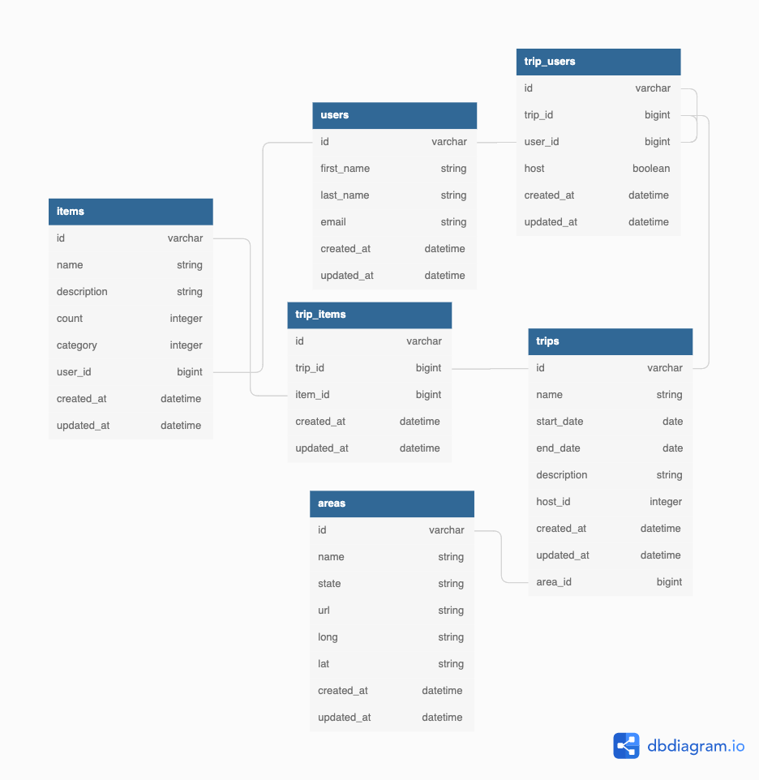
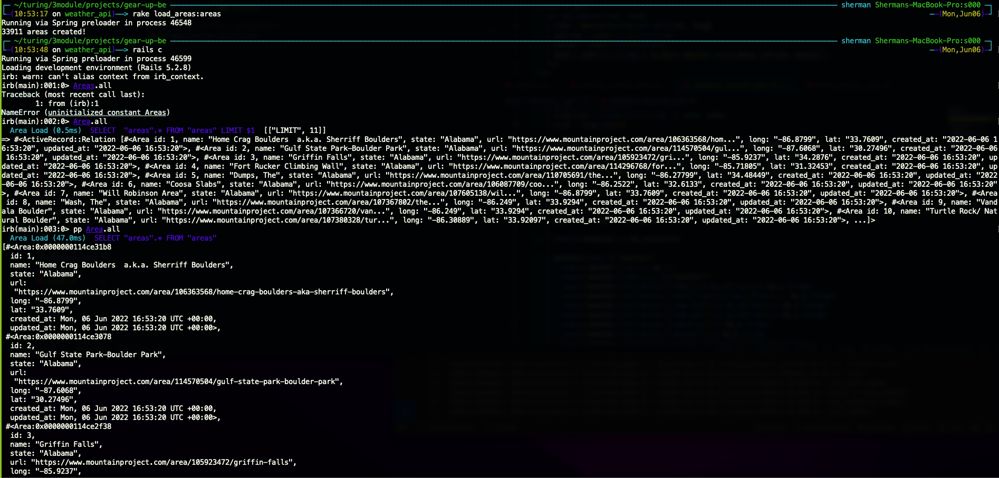
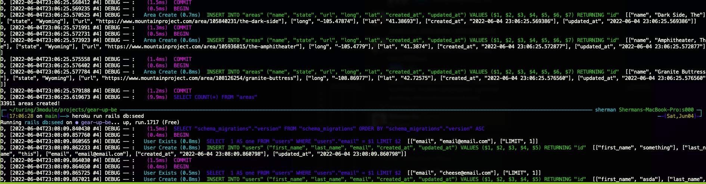

# **Gear-UP-BE**


 <!-- ALL-CONTRIBUTORS-BADGE:START - Do not remove or modify this section -->
[](#contributors-)
<!-- ALL-CONTRIBUTORS-BADGE:END -->


<hr>

<p align="center">
  
</p>

<hr>

## **Background and Description**

Logistics for group adventures outdoors can be complicated, especially when it comes to getting all of your gear in order. __Gear Up__ simplifies this by giving users a platform to easily organize trips, decide who is bringing what gear, then determine what the group still needs and who might have that gear already!

-[Gear Up BE](https://github.com/ShermanA-13/gear-up-be) is the "Back End" application that acts as a microservice for the [Gear UP FE](https://github.com/ShermanA-13/gear-up-fe) web application.
-[Consultancy Competition](https://backend.turing.edu/module3/projects/consultancy)<br>
-[MiroBoard](https://miro.com/app/board/uXjVOw873iE=/?share_link_id=273903554758)<br>

## **Table of Contents**
- [Background and Description](#background-and-description)
- [Schema](#schema)
- [Learning Goals](#learning-goals)
- [Requirements and Setup (for Mac):](#requirements-and-setup-for-mac)
    - [Ruby and Rails Versions](#ruby-and-rails-versions)
    - [Gems Utilized](#gems-utilized)
    - [APIs](#apis-consumed)
    - [SetUp](#setup)
- [Heroku Setup](#heroku-setup)
- [Endpoints](#endpoints-provided)
- [Contributors](#contributors-)
## **Schema**

## **Learning Goals**
### [Consultancy Competition](https://backend.turing.edu/module3/projects/consultancy/)
Our “Back End” application will be an API built in Rails. It will act as the interface layer to our database, and it will handle our API consumption.
```
* Rails Backend
    * this is a `rails new --api` project
        * it will have more thorough testing, follow our Facade and Service design patterns, and make use of Serializers
    * There is no ERB, HTML or CSS, JavaScript, anywhere in this project
 * All input is received as JSON data; it only responds with JSON data
    * we recommend eager loading where possible, and use of the “bullet” gem to detect N+1 queries
  * Extensions:
      1. using Rails caching and/or memoization to cache/memoize data retrieved from external APIs
      2. hosted on an alternate service provider (AWS, Digital Ocean, etc)
      3. use background worker
```


## **Requirements and Setup (for Mac):**

### **Ruby and Rails Versions**
---
- Ruby Version 2.7.2
- Rails Version 5.2.8

### **Gems Utilized**
---
- [capybara](https://github.com/teamcapybara/capybara)
- [faker](https://github.com/faker-ruby/faker)
- [factory_bot_rails](https://github.com/thoughtbot/factory_bot_rails)
- [faraday](https://github.com/lostisland/faraday)
- [figaro](https://github.com/laserlemon/figaro)
- [jsonapi-serializer](https://github.com/jsonapi-serializer/jsonapi-serializer)
- [jsonl](https://github.com/zenizh/jsonl)
- [launchy](https://github.com/copiousfreetime/launchy)
- [pry](https://github.com/pry/pry)
- [shoulda-matchers](https://github.com/thoughtbot/shoulda-matchers)
- [simplecov](https://github.com/simplecov-ruby/simplecov)
- [rspec_junit_formatter](https://github.com/sj26/rspec_junit_formatter)
- [rspec](https://relishapp.com/rspec)

## **APIs Consumed**
- [OpenWeather](https://openweathermap.org/api)
- [GoogleMaps](https://developers.google.com/maps)
- [Google OAuth 2.0](https://developers.google.com/identity/protocols/oauth2)
## **Setup**
1. Create a Base Directory
* On your local machine open a terminal session and enter the following commands to create a base directory for the app.

```shell
$ mkdir gear_up
$ cd gear_up
```

2. Clone these repositories:
* On your local machine open a terminal session and enter the following commands for SSH or HTTPS to clone the [back end](#background-and-description) repositiory.

- using ssh key <br>
```shell
$ git clone git@github.com:ShermanA-13/gear-up-be.git
```

- using https <br>
```shell
$ git clone https://github.com/ShermanA-13/gear-up-be.git
```

* Once cloned, enter the following commands for SSH or HTTPS to clone the [front end](#background-and-description) repositiory.

- using ssh key <br>
```shell
$ git clone git@github.com:ShermanA-13/gear-up-fe.git
```

- using https <br>
```shell
$ git clone https://github.com/ShermanA-13/gear-up-fe.git
```


* Once cloned, you'll have a new local copies of the directories you ran the clone command in. You can check what is in the directory by running the following command<br>

```sh
$ ls
#ex.
  gear-up-be gear-up-fe
```

4. Install required Gems utilizing Bundler: <br>
In terminal, use Bundler to install any missing Gems. If Bundler is not installed, first run the following command.

```shell
$ gem install bundler
```

* If Bundler is already installed or after it has been installed, run the following command.

```shell
$ bundle install
```

* There should be be verbose text diplayed of the installation process that looks similar to below. (this is not an actual copy of what will be output).
<details>
<summary><b>Click to see example!</b></summary>
<p>

```shell
$ bundle install
Fetching gem metadata from https://rubygems.org/...........
Fetching gem metadata from https://rubygems.org/.
Resolving dependencies...
Using rake 13.0.6
Using concurrent-ruby 1.1.10
...
...
...
Using simplecov_json_formatter 0.1.4
Using simplecov 0.21.2
Using spring 2.1.1
Using spring-watcher-listen 2.0.1
Using standard 1.12.1
Bundle complete! 23 Gemfile dependencies, 94 gems now installed.
Use `bundle info [gemname]` to see where a bundled gem is installed.
```

</p>
</details></br>

* If there are any errors, verify that bundler, Rails, and your ruby environment are correctly setup.

5. Figaro installation<br>

* Follow the [figaro](https://github.com/laserlemon/figaro) installation with the docs and get your [openweather.org](#apis-consumed) key. Add the open weather api key to your newly created `config/application.yml` file and add it to your `.gitignore` file. Be sure to read the [open weather API docs](https://openweathermap.org/forecast5) for a deeper undestanding of the app.

```sh
$ bundle exec figaro install
```

6. Database Migration<br>
Before using the web application you will need to setup your databases locally by running the following command

```shell
$ rails db:{:drop,:create,:migrate}
```

<details>
<summary><b>Click to see example!</b></summary>
<p>

```shell
Created database 'gear_up_be_development'
Created database 'gear_up_be_test'
== 20220602171308 CreateUsers: migrating ======================================
-- create_table(:users)
   -> 0.0051s
== 20220602171308 CreateUsers: migrated (0.0051s) =============================

== 20220602171328 CreateItems: migrating ======================================
-- create_table(:items)
   -> 0.0081s
== 20220602171328 CreateItems: migrated (0.0081s) =============================

== 20220602171337 CreateTrips: migrating ======================================
-- create_table(:trips)
   -> 0.0020s
== 20220602171337 CreateTrips: migrated (0.0020s) =============================

== 20220602171347 CreateTripUsers: migrating ==================================
-- create_table(:trip_users)
   -> 0.0036s
== 20220602171347 CreateTripUsers: migrated (0.0036s) =========================

== 20220602171355 CreateTripItems: migrating ==================================
-- create_table(:trip_items)
   -> 0.0028s
== 20220602171355 CreateTripItems: migrated (0.0028s) =========================

== 20220604204302 CreateAreas: migrating ======================================
-- create_table(:areas)
   -> 0.0015s
== 20220604204302 CreateAreas: migrated (0.0016s) =============================

== 20220604214856 AddAreaToTrip: migrating ====================================
-- add_reference(:trips, :area, {:foreign_key=>true})
   -> 0.0016s
== 20220604214856 AddAreaToTrip: migrated (0.0017s) ===========================

== 20220604220355 RemoveLocationFromTrip: migrating ===========================
-- remove_column(:trips, :location, :string)
   -> 0.0003s
== 20220604220355 RemoveLocationFromTrip: migrated (0.0003s) ==================
```

</p>
</details></br>


7. Seeding Database<br>
In terminal, use `$ rake load_areas:areas` to parse through the `openbeta-conus-areas.jsonlines` and seed into your database.

```shell
$ rake load_areas:areas
```

<details>
<summary><b>Click to see example!</b></summary>
<p>

```shell
Running via Spring preloader in process 20363
33911 areas created!
```
<a href="./docs/images/load_areas.png" title ="load_areas:areas"></a>

</p>
</details></br>

* Then run the command:

```shell
$ rails db:seed
```

8. Startup and Access<br>
<p>
  In `/config/puma.rb`, you'll notice that the port has changed from 3000 to 5000. This should be on or around line 12.
</p>

```ruby
port  ENV.fetch("PORT") { 5000 }
```

<p>
  We do this because [Gear Up BE](https://github.com/ShermanA-13/gear-up-be) is not in production or hosted somewhere other than localhost. If Gear Up BE is running on `port 3000`, our front end will need to have a different port so they can run at the same time. Now, when we do `rails s`, our back end application will automatically use port 5000. You can also do this manually every time you start your server by passing the port number with a `-p` flag like so:
</p>

```sh
`rails s -p 5000`.
```

* You should see that your server is `"listening on tcp://localhost:5000"` now instead of the usual 3000.


**In order for your frontend to properly get data from your backend Gear Up API, you must keep your backend server running locally at the same time.**

* Finally, in order to use the web app you will have to start the both Gear Up BE and Gear Up FE servers
- Start the back end server

```shell
$ rails s
```

<details>
<summary><b>Click to see example!</b></summary>
<p>

```shell
=> Booting Puma
=> Rails 5.2.8 application starting in development
=> Run `rails server -h` for more startup options
Puma starting in single mode...
* Version 3.12.6 (ruby 2.7.2-p137), codename: Llamas in Pajamas
* Min threads: 5, max threads: 5
* Environment: development
* Listening on tcp://localhost:5000
Use Ctrl-C to stop
```

</p>
</details></br>

* Switch to a new tab `CMD + T` in your terminal then navigate to the front end directory with the command:

```sh
$ cd ../gear-up-fe
```

* Your file patch in your new tab in terminal should be `./gear_up/gear-up-fe`. Start the front end server

```sh
$ rails s
```

* Open web browser and visit link to access the front end application
    http://localhost:3000

* At this point you should be taken an index page with clickable links to different data sets with the ability to create, read, update, and delete data.

## **Heroku Setup**
* If this is your first time setting up a Heroku server. Take your time to read these documents [Heroku Getting Started w/ Rails](https://devcenter.heroku.com/articles/getting-started-with-rails5) to familiarize yourself.<br>

1. [Deploy Application to Heroku](https://devcenter.heroku.com/articles/getting-started-with-rails5#deploy-your-application-to-heroku) is where you want to be after an account is created because your app already exists. You want to repeat the process for the front end application as well. You can check if your app is added on heroku with this command:

```sh
$ git remote -v
```
<details>
<summary><b>Click to see example!</b></summary>
<p>

```shell
heroku	https://git.heroku.com/<your app name>.git (fetch)
heroku	https://git.heroku.com/<your app name>.git (push)
origin	git@github.com:<your github username>/gear-up-be.git (fetch)
origin	git@github.com:<your github username>/gear-up-be.git (push)
```

</p>
</details></br>

* If your terminal doesn't reflect the example above input this command

```sh
$ heroku git:remote -a <yourapp>
```
2. Deploy your code:
```sh
$ git push heroku main
```
3. Migrate and seed your database:

```sh
$ heroku run rails db:{create,migrate}
```
* Once your migrations are finished run this command and after awhile your terminal will produce a similar result in the example below

```sh
heroku run rake load_areas:areas
```

<details>
<summary><b>Click to see example!</b></summary>
<p>

<a href="./docs/images/heroku_load_areas.png" title ="heroku_load_areas:areas"></a>

</p>
</details></br>

4. Ensure your API keys are set up on your web app
```
From your Heroku dashboard, click on the project you just created, then Settings. In the Config Vars section, click Reveal Config Vars. Here, you can add any API keys with the constant name you gave them in the application.yml file created from the figaro gem.
```
## **Endpoints Provided**
[Download the test suites for Postman:]()

<details>
<summary><b>Click to see example!</b></summary>
<p>

```sh
        api_v1_users    GET    /api/v1/users(.:format)                                   api/v1/users#index
                        GET    /api/v1/users/:user_id(.:format)                          api/v1/users#show
                        POST   /api/v1/users(.:format)                                   api/v1/users#create
                        GET    /api/v1/users/:user_id/items(.:format)                    api/v1/items#index
                        GET    /api/v1/users/:user_id/items/:item_id(.:format)           api/v1/items#show
                        POST   /api/v1/users/:user_id/items(.:format)                    api/v1/items#create
                        PATCH  /api/v1/users/:user_id/items/:item_id(.:format)           api/v1/items#update
                        DELETE /api/v1/users/:user_id/items/:item_id(.:format)           api/v1/items#destroy
                        GET    /api/v1/trips/:trip_id/info(.:format)                     api/v1/trips#info
                        GET    /api/v1/users/:user_id/trips(.:format)                    api/v1/trips#index
                        GET    /api/v1/trips/:trip_id(.:format)                          api/v1/trips#show
                        POST   /api/v1/users/:user_id/trips(.:format)                    api/v1/trips#create
                        PATCH  /api/v1/trips/:trip_id(.:format)                          api/v1/trips#update
                        DELETE /api/v1/trips/:trip_id(.:format)                          api/v1/trips#destroy
                        GET    /api/v1/trips/:trip_id/users(.:format)                    api/v1/trip_users#index
                        POST   /api/v1/trips/:trip_id/users(.:format)                    api/v1/trip_users#create
                        PATCH  /api/v1/trips/:trip_id/users(.:format)                    api/v1/trip_users#update
                        GET    /api/v1/trips/:trip_id/items/:user_id(.:format)           api/v1/trip_items#index
                        GET    /api/v1/trips/:trip_id/items(.:format)                    api/v1/trip_items#show
                        POST   /api/v1/trips/:trip_id/items(.:format)                    api/v1/trip_items#create
                        PATCH  /api/v1/trips/:trip_id/items(.:format)                    api/v1/trip_items#update
                        DELETE /api/v1/trips/:trip_id/items/:trip_item_id(.:format)      api/v1/trip_items#destroy
                        GET    /api/v1/areas/:area_id/weather(.:format)                  api/v1/weathers#index
api_v1_areas_find_all   GET    /api/v1/areas/find_all(.:format)                          api/v1/areas#find_all
                        GET    /api/v1/areas/:id(.:format)                               api/v1/areas#show
```

</p>
</details></br>

## **Contributors ✨**

Thanks go to these wonderful people ([emoji key](https://allcontributors.org/docs/en/emoji-key)):

<!-- ALL-CONTRIBUTORS-LIST:START - Do not remove or modify this section -->
<!-- prettier-ignore-start -->
<!-- markdownlint-disable -->
<table>

  <tr>

   <td align="center"><a href="https://github.com/ShermanA-13"><br /><sub><b>Sherman A. (he/him)</b></sub></a><br /><a href="https://www.linkedin.com/in/sherman-au-2b4a69142/" title ="Linked In"></a><br /><a href="https://github.com/ShermanA-13/gear-up-be/commits?author=ShermanA-13" title="Code">💻</a> <a href="" title="Ideas, Planning, & Feedback">�</a> <a href="" title="Tests">⚠️</a> <a href="https://github.com/ShermanA-13/gear-up-be/pulls?q=is%3Apr+author%3AShermanA-13" title="Reviewed Pull Requests">👀</a></td>

   <td align="center"><a href="https://github.com/sueboyd922"><br /><sub><b>Susan B. (she/her)</b></sub></a><br /><a href="https://www.linkedin.com/in/susan-boyd-6ba8749b/" title ="Linked In"></a><br /><a href="https://github.com/ShermanA-13/gear-up-be/commits?author=sueboyd922" title="Code">💻</a> <a href="" title="Ideas, Planning, & Feedback">�</a> <a href="" title="Tests">⚠️</a> <a href="https://github.com/ShermanA-13/gear-up-be/pulls?q=is%3Apr+author%3Asueboyd922" title="Reviewed Pull Requests">👀</a></td>

   <td align="center"><a href="https://github.com/phillipkamps/landing_page"><br /><sub><b>Phillp K. (he/him)</b></sub></a><br /><a href="https://www.linkedin.com/in/phillip-kamps/" title ="Linked In"></a><br /><a href="https://github.com/ShermanA-13/gear-up-be/commits?author=phillipkamps" title="Code">💻</a> <a href="" title="Ideas, Planning, & Feedback">�</a> <a href="" title="Tests">⚠️</a> <a href="https://github.com/ShermanA-13/gear-up-be/pulls?q=is%3Apr+author%3Aphillipkamps" title="Reviewed Pull Requests">👀</a></td>

   <td align="center"><a href="https://github.com/sandisz-d734m37"><br /><sub><b>Sandiz T. (he/him)</b></sub></a><br /><a href="https://www.linkedin.com/in/sandisz-thieme-25335316a/" title ="Linked In"></a><br /><a href="https://github.com/ShermanA-13/gear-up-be/commits?author=sandisz-d734m37" title="Code">💻</a> <a href="" title="Ideas, Planning, & Feedback">�</a> <a href="" title="Tests">⚠️</a> <a href="https://github.com/ShermanA-13/gear-up-be/pulls?q=is%3Apr+author%3Asandisz-d734m37" title="Reviewed Pull Requests">👀</a></td>

   <td align="center"><a href="https://github.com/johnny-bowman"><br /><sub><b>Johnny B. (he/him)</b></sub></a><br /><a href="https://www.linkedin.com/in/johnnybowmansoftware/" title ="Linked In"></a><br /><a href="https://github.com/ShermanA-13/gear-up-be/commits?author=johnny-bowman" title="Code">💻</a> <a href="" title="Ideas, Planning, & Feedback">�</a> <a href="" title="Tests">⚠️</a> <a href="https://github.com/ShermanA-13/gear-up-be/pulls?q=is%3Apr+author%3Ajohnny-bowman+" title="Reviewed Pull Requests">👀</a></td>

   <td align="center"><a href="https://github.com/AliciaWatt"><br /><sub><b>Alicia W. (she/her)</b></sub></a><br /><a href="https://www.linkedin.com/in/alicia-watt-3bb815225/" title ="Linked In"></a><br /><a href="https://github.com/ShermanA-13/gear-up-be/commits?author=AliciaWatt" title="Code">💻</a> <a href="" title="Ideas, Planning, & Feedback">�</a> <a href="" title="Tests">⚠️</a> <a href="https://github.com/ShermanA-13/gear-up-be/pulls?q=is%3Apr+author%3AAliciaWatt" title="Reviewed Pull Requests">👀</a></td>
  </tr>
</table>

<!-- markdownlint-restore -->
<!-- prettier-ignore-end -->

<!-- ALL-CONTRIBUTORS-LIST:END -->

This project follows the [all-contributors](https://github.com/all-contributors/all-contributors) specification.
<!--
